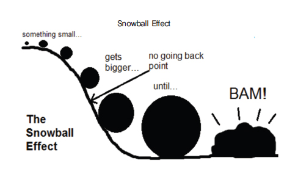

시프트-레프트 테스트
=============

- 모든 단계의 버그를 시스템 테스트로 해결하지 말 것
    -> 사실 애자일에서도 마지막 테스트&유지보수 상태에서 버그를 시스템 테스트로 잡아내려하는데, 이것도 혼돈상태라고 봐야함
    - 왜냐? **제품 개발 과정에서 테스트가 제일 분주한 시점일텐데 이걸 후반부에 두어 일정에 쫓겨 릴리스 한다는 건 결국 리스크이기 때문**
    - 다른 공학 계열에서 어떻게 테스트를 하는지 대입해 생각해볼 것 -> 예를 들어 제조업에서 각 부품의 신뢰성을 확인하지도 않고 갑자기 완제품을 테스트 해보진 않듯이, 소프트웨어도 각각의 단위 테스트도 진행하지 않은 상태에서 통합 테스트를 진행하는 것은 생산적이지 못함

Q) 개인적인 의문
1. 그러면 애자일하게 일을 진행하는 팀에서는 테스트를 전부 코딩후에 하는건가?
2. 테스트코드를 작성하는 것만으로는 커버가 안되는건가? -> 개발자가 코드작성, 테스트 담당자가 테스트코드 작성등으로는 커버 불가능?

## 2.1 시프트-레프트 모델

- 그래서 조기 품질을 높이기 위한 시프트-레프트 모델이란?
  - 요구 사항 및 사용자 스토리의 명확화
  - 클래스나 함수 구조를 간단히 유지
  - 단위 및 통합 테스트 실행
  - 리뷰 실시

Q) 사용자 스토리의 명확화라는건 페르소나 얘기하는건가?

## 2.2 시프트-레프트 테스트 특징

사실상 모든 조직은 아래와 같은 딜레마를 안고 있음 

1. 경영진은 시프트-레프트로 품질 보증을 원하나 엔지니어들이 바쁘다고 회피함
2. (회피라곤 했지만..) 실제로 엔지니어들은 바쁨

**그러나 수치적으로 조기 단계에서에서 품질을 보증하는 편이 출시 후의 품질을 높이는 지름길**
결론적으로 후반 단계에서 버그를 찾아내도 출시 후의 오류를 줄이는 데는 한계가 있음. 통합 테스트에서 발견하는 버그는 많아봐야 40%이고 조기단계에서 발견할 수 있는 버그는 85%

Q) 구체적으로 조기단계에서 발견할 수 있는 버그라는게 뭐지? 설계상의 오류를 뜻하는 것같음..

조기 코드 인스펙션, 리뷰, 반복 개발, 주기적 구축 등에 중점을 두면 결함 추출 곡선은 개발 초기 단계로 이동함

그래서 코드리뷰나 인스펙션을 충분히 실시해서 통합 테스트나 시스템 테스트에서 발견되지 않도록 해야함!

- 프로젝트 후반에 버그를 없애는 비용은 전반에 드는 비용의 수 배에 달함 -> 효율 낮음 = 비용 발생
- 프로젝트 후반에 버그를 없애려고하면 해결되지 않은 버그가 출시 후에 남겨질 리스크 또한 존재

전문적으로 얘기하자면 개발 단계가 뒤로 갈수록 버그 수정에 드는 공수가 기하급수적으로 올라감 (요구사항에서 1의 난이도라면 출시후엔 100의 난이도인셈)

PS) 그런데 코드 인스펙션이 뭐야? (참조 : https://dataonair.or.kr/db-tech-reference/d-lounge/expert-column/?mod=document&uid=54455)

코드 인스펙션 = 코드 정적 분석, 그러니까 실행해서 코드가 잘 돌아가는지 확인하는게 아니라 구문 오류가 있는지 논리적으로 맞는지 툴을 이용해 분석하는 것 -> 그냥 별거 아니고 우리가 아는 ESLint, IntelliJ Inspection 이런거임

PS) 이터레이션이란? 이터레이션은 개발 과정을 나타내는 데 사용되는 용어로, 특히 애자일 개발 방법론에서 각 개발 사이클 또는 단계를 의미 (고마워 따봉 GPT야!)

