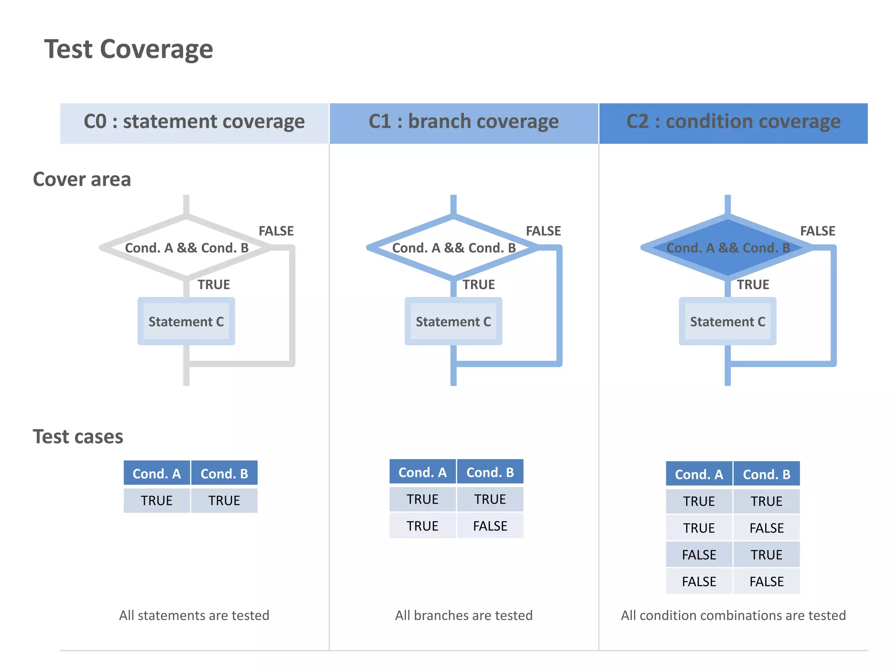

코드 기반 단위 테스트
=============

단위테스트 = 광범위하게 사용됨. 코드의 정확성을 확인하는 테스트인지 단위 기능에 관한 테스트인지를 명확하게 할 것

## 4.1 코드 기반 단위 테스트

- 함수의 커버리지 비율을 측정해 로직의 확실성을 확인하는 화이트박스 테스트 = 코드 기반 단위 테스트

*화이트박스 테스트 = 모듈의 원시 코드를 오픈시킨 상태에서 원시 코드의 논리적인 모든 경로를 테스트하여 테스트 케이스를 설계하는 방법

다음과 같은 항목 확인

- 프로그램을 실행하는 도중 시스템상의 이상 작동을 수행하지 않음(null pointer, 0으로 나누는 계산)
- 입력값과 그에 대응하는 기댓값을 출력
- 모든 분기가 올바르게 처리됨(경곗값 테스트)

## 4.2 명령 커버리지(C2)

**C0커버리지**라고도 부름

간단하게 설명하자면 테스트 기준(테스트에서 적어도 한번은 모든 명령문을 실행)을 세우고 모든 조건분기를 타도록함 = 그러나 이 경우 테스트할 수 없는 경로가 발생하기도함

-> 불완전한 테스트, 그래서 **조건 커버리지**를 같이 수행해야함

## 4.3 조건 커버리지(C1)

**C1 커버리지**, C0 커버리지의 문제를 해결하는 기법 = 대부분의 경우 이 커버리지 방법으로 수행하는 것이 좋음

간단하게 설명하자면 각각의 판정조건이 TRUE,FALSE인 결과를 적어도 1번씩 가지는 테스트 케이스를 작성하는 것

### 참고 예시

## 4.4 자주 발생하는 단위 테스트 오류

이전까지만보면 조건 커버리지면 만사 OK 같지만,
**함수의 in/out을 체크하고 함수가 그 책임과 의무를 달성하는지도 동시에 주의해야함**

그래서 입력값의 패턴을 100% 커버하고, 그에 대한 기대 처리가 올바른지를 체크하는 것이 효과적인 단위테스트

## 4.5 코드 기반 단위 테스트 작성법

### 테스트 주도 개발 (TDD) = 애자일 개발과 상성이 좋음!
- 실제 소스 코드를 작성하기 전에 테스트 케이스를 작성
- 모든 테스트 코드를 자동화
- 버그는 즉시 수정
- 전문 테스트 담당자를 투입

### 일반적인 테스트 방법

테스트 코드를 먼저 작성한 뒤 실제 함수 처리를 작성

**TDD의 단계**
1. 레드: 항상 실패하는 테스트를 작성(간단하게 메서드의 형태만 작성해두고)
2. 그린: 테스트를 통과할 정도의 최소한의 프로덕션 코드를 작성(올바르게 로직을 작성하고)
3. 리팩터: 테스트가 통과하면 프로덕션 코드를 리팩토링(개선을 한다)

PS) 레드 -> 그린 -> 리팩터 순으로 짜고 커밋할 것

## 4.6 커버리지 비율: 코드 기반 단위 테스트의 성패를 측정

자동차같은 미션 크리티컬 소프트웨어라면 100퍼의 커버리지가 필요하지만, 그 외의 소프트웨어라면 80퍼도 충분!(사실 어디서도 커버리지 비율의 적절한 목표에 대해서 정해놓지않음. 논문이든 ISO나 IEEE규격이든)

그러면 왜 80%가 충분하냐? 소스 코드의 20% 정도는 에러 핸들링 처리인 만큼 그 코드까지 단위테스트로 커버할 필요는 없기때문

구글 코드 커버리지와 관련한 내부 가이드 라인
- 60% : 허용 범위
- 75% : 권장
- 90% : 모범적